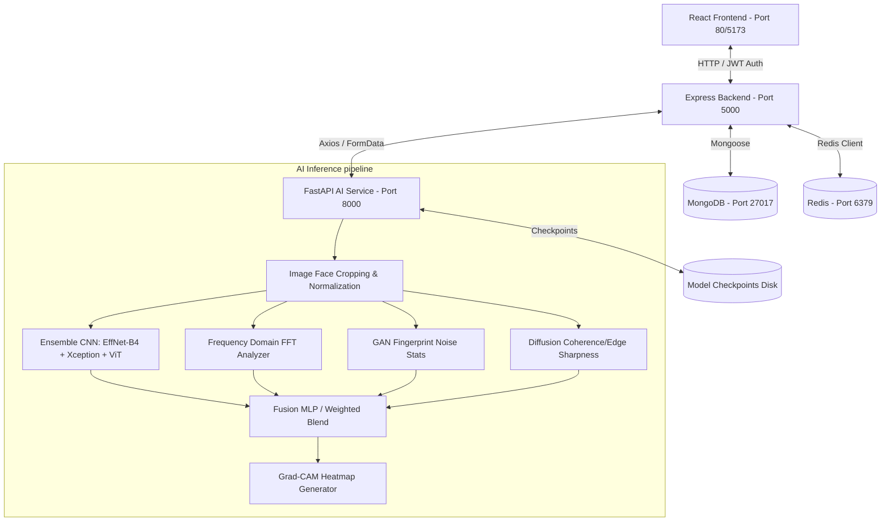

# Project Analysis: AuthenticEye

## 1. System Architecture Diagram
Below is the data and control flow diagram of the current AuthenticEye system, detailing communication across the Client, Backend Server, MongoDB, Redis, and FastAPI AI Service.

---

## 2. Component Audits

### Frontend Architecture
- **Framework**: React SPA powered by Vite.
- **Styling**: Tailwind CSS configured in `tailwind.config.js` and `postcss.config.js`.
- **Routing**: Client-side routing managed by `react-router-dom` in `App.jsx`.
- **State & API Interaction**: Simple local state hooks and centralized Axios interceptors in `services/api.js` to automatically attach JWT tokens.
- **Key Views**:
  - `Hero`, `Features`, `Industries` (Landing elements)
  - `UploadAnalyzer`, `ResultCard` (Interactive verification and result visualizers)
  - `AnalysisHistory` (Historical analysis retrieval)
  - `AdminDashboard` (User feedback review, retraining trigger, model registry, and rollbacks)

### Backend Architecture
- **Framework**: Node.js & Express.
- **Database Layer**: Mongoose schemas modeling users, analyses, feedback, model versions, and audit logs.
- **Middleware**:
  - `authMiddleware.js`: Validates JWT token from the `Authorization` header.
  - `adminMiddleware.js`: Rejects requests from non-admin users.
  - Rate limiting via `express-rate-limit` (100 requests per 15 minutes per IP).
  - Basic security headers injected by `helmet`.
- **API Endpoint Groups**:
  - `/api/auth`: Register and Login handler.
  - `/api/detect`: Receives uploaded files using `multer` and forwards them to the Python AI service.
  - `/api/history`: Retrieval and deletion of analysis history.
  - `/api/feedback`: Endpoint for normal users to submit correction feedback.
  - `/api/admin`: Admin controls including feedback verification, model retraining triggers, and version rollbacks.

### Database Schema (MongoDB Mongoose Models)
- **User** (`User.js`):
  - `name`: String (Required)
  - `email`: String (Unique, Required)
  - `password`: String (Hashed using bcrypt)
  - `role`: String ('user' | 'admin', default 'user')
- **Analysis** (`Analysis.js`):
  - `userId`: ObjectId (Ref User)
  - `fileUrl`: String (Local path to the saved file)
  - `mediaType`: String ('image' | 'video')
  - `deepfakeProbability`: Number
  - `authenticityScore`: Number
  - `ganProbability`: Number
  - `diffusionProbability`: Number
  - `heatmapBase64`: String
  - `modelScores`: Object
  - `faceDetected`: Boolean
  - `createdAt`: Date
- **Feedback** (`Feedback.js`):
  - `analysisId`: ObjectId (Ref Analysis)
  - `userLabel`: String ('real' | 'fake')
  - `status`: String ('pending' | 'verified' | 'rejected')
  - `verifiedLabel`: String ('real' | 'fake')
  - `isUsedInRetraining`: Boolean
  - `createdAt`: Date
- **ModelVersion** (`ModelVersion.js`):
  - `version`: String (Unique)
  - `status`: String ('active' | 'rolled_back' | 'inactive')
  - `metrics`: Object (accuracy, precision, recall, f1, auc)
  - `efficientnetPath`: String
  - `xceptionnetPath`: String
  - `vitPath`: String
  - `trainedOnSamplesCount`: Number
  - `createdAt`: Date
- **AuditLog** (`AuditLog.js`):
  - `action`: String
  - `userId`: ObjectId (Ref User)
  - `details`: Object
  - `createdAt`: Date

### AI Service Architecture
- **Framework**: Python FastAPI (`main.py`) running on Uvicorn.
- **Model Loaders**:
  - Core Deep Learning models: `timm`-based `efficientnet_b4`, legacy `xception`, and `vit_base_patch16_224` loaded via PyTorch. Looks for checkpoints in `./checkpoints`, falling back to ImageNet weights.
  - Specialized Physics-based Detectors:
    - Frequency Domain Analyzer: Single-channel MobileNetV3-Small classifier on FFT magnitude spectrum + raw high-to-low ratio.
    - GAN Fingerprint Detector: EfficientNet-B0 on HP-filtered residual noise map + kurtosis / energy statistics.
    - Diffusion Traces Detector: ResNet50 classifier + color coherence + edge sharpness.
- **Decision Fusion**: Combines scores either via an MLP (`fusion_mlp.pth`) or a static weighted blend (0.08 * eff + 0.08 * xcep + 0.09 * vit + 0.35 * freq + 0.25 * gan + 0.15 * diff).
- **Grad-CAM**: Extracts Class Activation Map gradients from the primary model (EfficientNet-B4) and returns a base64 overlay image.

---

## 3. System Flows

### Authentication Flow
1. User provides email and password.
2. Express server validates credentials and generates a 1-day JWT token (`jwt.sign()`).
3. Frontend stores the token in `localStorage`.
4. Axios interceptor grabs the token and appends `Bearer <token>` to headers.

### Upload Flow
1. User uploads an image or video file via React UI.
2. Express server uses `multer.diskStorage` to write the file temporarily to `/backend/uploads`.
3. Checks extensions (JPEG/PNG/WEBP for images; MP4/MOV/AVI/WEBM for videos).

### Detection Flow
1. Express backend forwards the file via Axios `FormData` streams to the Python AI service.
2. AI Service:
   - For images: performs MTCNN face detection/crop, normalizes, runs ensemble models and statistical extractors concurrently in a ThreadPoolExecutor.
   - For videos: reads frames, performs temporal analyses, runs frame-wise predictions, and computes drift.
3. Grad-CAM generates overlays based on the primary model's classification activations.
4. AI service responds with scores and visuals.
5. Express server saves the results to MongoDB `Analysis` collection and responds to the frontend.

### Model Serving & Loading Flow
1. FastAPI launches, calling `@app.on_event("startup")`.
2. Core ensemble loads checkpoints from `/app/checkpoints/` if present.
3. Submodules (frequency, gan, diffusion, temporal) initialize their weights.
4. Tries to load `fusion_mlp.pth` for final decision boundaries; if absent, falls back to the hardcoded weighted average.

---

## 4. Strengths, Bottlenecks, and Issues

### Current Strengths
- **Modular Pipeline**: Clean isolation between user interface, routing server, and heavyweight tensor math execution.
- **Hybrid Signals**: Fusing semantic deep learners with physics-based signal verification (FFT checkerboard, GAN noise distribution) creates robustness against unseen adversarial perturbations.
- **Version Tracking**: Ready-made endpoints for recording accuracy baselines, logging audits, and rolling back checkpoints.

### Performance Bottlenecks
- **Main Event Loop Blocking**: Video inference is synchronous and can block FastAPI worker processes.
- **Double Networking & Disk IO**: Files are written to the backend disk, read into memory, sent to the AI service, processed, and potentially saved. This adds network and disk latency.
- **Synchronous Training**: Retraining the model blocks resources and has no async progression tracking.

### Security Issues
- **No Content Security Policy (CSP)**: Exposes the React App to cross-site scripting (XSS).
- **No CSRF Protection**: Actions could be triggered by forged cross-site requests.
- **No Refresh Token Flow**: The long-lived 1-day access token increases access compromise risks.
- **Lack of Upload Validation**: Uploaded file headers/magic bytes are not verified; files are not scanned for viruses.
- **Input Sanitization**: Database inputs are not explicitly sanitized against MongoDB Injection.

### Scalability Issues
- **BullMQ / Redis Queue Missing**: Redis is listed in `docker-compose.yml` but not integrated in Express. Heavy operations like batch uploads or videos run directly on HTTP threads.
- **Single Node Dependency**: The retraining and evaluation pipelines run on the serving AI instance, degrading inference response rates.

### AI Limitations
- **ImageNet Fallbacks**: Core classifiers revert to general ImageNet weights if custom checkpoints are missing.
- **Fixed Linear Blends**: The hardcoded forensic blending weights lack robust validation on distinct deepfake data domains.
- **Manual Feature Thresholds**: Relying on arbitrary statistics floors (e.g., kurtosis floor of 5.5) lacks domain adaptation.
