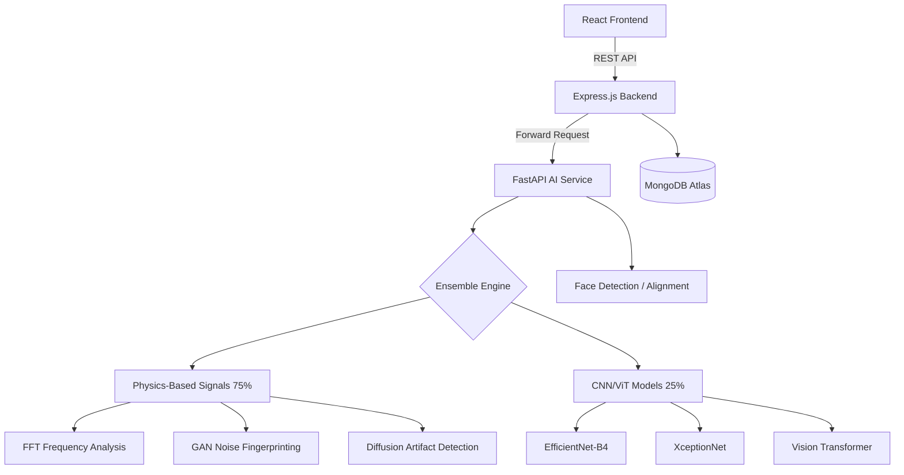

# AuthenticEye — Forensic-Grade Deepfake Detection Platform

A production-ready deepfake detection platform that combines state-of-the-art Deep Learning (CNNs/Transformers) with Physics-based Forensic Science to detect manipulated images and videos with high reliability, even without massive training data.

---

## 🏗️ System Architecture



---

## 🔬 AI Detection Strategy (Physics-First)

AuthenticEye uses a unique **Physics-First Ensemble**. Unlike standard detectors that rely 100% on black-box neural networks, we weight scientific forensic signals at 75% to ensure accuracy on "in-the-wild" deepfakes.

| Method | Purpose | Why it works |
| :--- | :--- | :--- |
| **FFT Frequency** | Image Synthesis | GAN upsampling leaves periodic "checkerboard" artifacts in the FFT magnitude spectrum. |
| **GAN Fingerprint** | Model Forensic | Every GAN generator leaves model-specific residual noise with Super-Gaussian kurtosis. |
| **Diffusion Analysis** | Stable Diffusion | Denoising diffusion models produce isotropic noise and unnaturally high color coherence. |
| **Deep Ensemble** | Visual Pattern | EfficientNet, Xception, and ViT look for high-level semantic inconsistencies in faces. |

---

## 🚀 Quick Start (Local Development)

### 1. Prerequisites
- **Node.js** v18+
- **Python** 3.11+ (with `venv`)
- **MongoDB** running locally or via Atlas

### 2. Manual Service Startup
Open 3 separate terminals in the project root:

**Terminal 1: Backend**
```powershell
cd backend
# Note: Ensure .env exists with AI_SERVICE_URL=http://localhost:8000
npm install
node server.js
```

**Terminal 2: AI Service**
```powershell
cd ai-service
# Requires python -m venv venv and pip install -r requirements.txt
.\venv\Scripts\activate
uvicorn main:app --host 0.0.0.0 --port 8000
```

**Terminal 3: Frontend**
```powershell
cd frontend
# Note: Ensure .env exists with VITE_API_URL=http://localhost:5000/api
npm install
npm run dev
```

---

## 🏋️ Training Pipeline

AuthenticEye includes a comprehensive training suite supporting both local and cloud devices.

### 1. Cloud Training (Recommended)
Use the included **[AuthenticEye_Colab_Training.ipynb](./AuthenticEye_Colab_Training.ipynb)** to train on high-end GPUs.
- Mount Google Drive
- Connect to T4/A100 GPU
- Automated Dataset Preparation & Training

### 2. Local Training
```powershell
cd ai-service
# 1. Prepare data (Kaggle or Local)
python scripts/prepare_dataset.py --source ./raw_data --dest ./prepared_data --download-sample

# 2. Train Models
python training/trainer.py --model efficientnet_b4 --data_dir ./prepared_data --epochs 50 --use_amp
```

---

## 📂 Project Structure

```
AuthenticEye/
├── frontend/          # React (Vite) + TailwindCSS
├── backend/           # Node.js Express API
├── ai-service/        # Python FastAPI engine
│   ├── features/      # Physics & Signal extractors
│   ├── models/        # Ensemble (EfficientNet, Xception, ViT)
│   ├── training/      # Core training logic
│   └── scripts/       # Dataset pipelines
└── training/          # Legacy/Utility training scripts
```

---

## 🛡️ Security Features

- **JWT Authentication** for history and dashboards.
- **Helmet.js** security headers.
- **Express-rate-limit** to prevent API abuse.
- **Automatic Cleanup:** Files are unlinked immediately after AI analysis.
