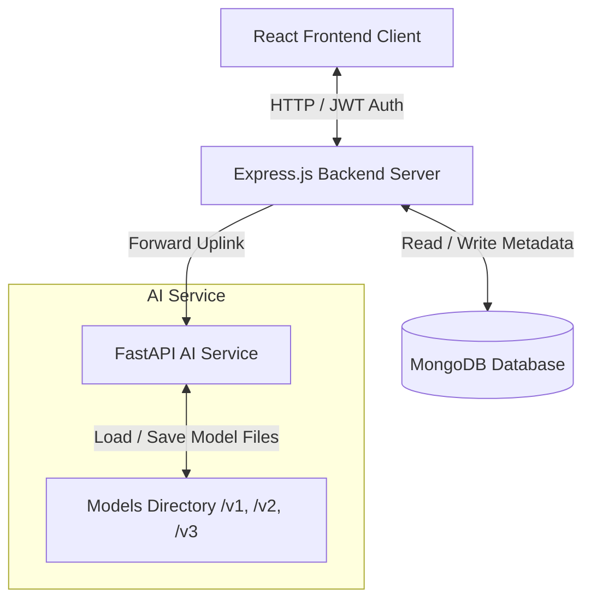

# AuthenticEye Platform — System Architecture Guide

This guide outlines the microservices architecture, data flow paths, and structural components of the AuthenticEye Deepfake Detection Platform.

---

## 1. High-Level Architecture Diagram

---

## 2. Core Components

### React Frontend Client
- Provides a responsive user experience with glassmorphism styling and custom CSS.
- Handles visual forensically enriched uploads and explainability tabs (Original, Grad-CAM, FFT, Artifacts).
- Implements secure authentication state tracking using HTTP-only cookies and Authorization headers.

### Express.js Backend Server
- Acts as the gateway API, routing requests, validating user authentication, and serving static uploaded artifacts.
- Manages security scans (magic byte verification, checksum hashing, virus scanning) and upload quarantine promotion.
- Stores historical detections, model versions, audit logs, and feedback loops in **MongoDB**.

### FastAPI AI Service
- Python microservice running PyTorch models and specialized CV2 detectors.
- Houses the ensemble classifier combining outputs from EfficientNet-B4, XceptionNet, FFT signal statistics, and visual artifact ratios.
- Generates base64 explainability heatmaps on request.
- Manages version folder rotation and rollback replication.

---

## 3. Data Processing Flows

### A. Image Upload & Single Forensic Scan
1. User drops file in frontend upload zone.
2. Frontend posts file to `/api/detect/image`.
3. Backend uploads file to `/uploads/quarantine/` and performs checks:
   - Verifies magic byte headers match MIME (JPG, PNG, WEBP).
   - Generates SHA-256 hash.
   - Run Mock Anti-Virus Scan.
4. If clean, file is promoted to `/uploads/` and forwarded to FastAPI `/detect/image`.
5. FastAPI service:
   - Processes face coordinates (MediaPipe Face Mesh fallback to Haar cascades).
   - Feeds aligned cropped face to CNN models.
   - Extracts FFT frequency ratios and Artifact densities.
   - Classifies via Logistic Regression ensemble model.
   - Generates Grad-CAM, FFT, GAN, and face bounding box heatmaps.
6. FastAPI returns metadata and base64 heatmaps.
7. Backend decodes base64 heatmaps, writes image files to `/uploads/explanations/`, saves records to MongoDB, and returns JSON payload.

